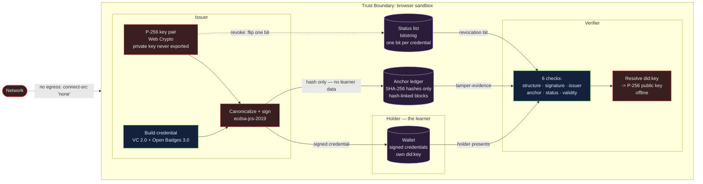

# VeriCred — Verifiable Academic Credentials: a browser-based reference implementation of learner-owned credentials that any verifier can check offline, with no registry and no call to the registrar

[](https://github.com/Freddricklogan/verifiable-academic-credentials/actions/workflows/deploy.yml)
[](#5-getting-started--verification)
[](https://github.com/Freddricklogan/verifiable-academic-credentials/actions/workflows/codeql.yml)
[](LICENSE)
[](https://freddricklogan.github.io/verifiable-academic-credentials/)

> **Scope, stated plainly.** The cryptography here is real and it runs in your
> browser: P-256 key pairs from the Web Crypto API, ECDSA signatures over a
> canonicalized document, `did:key` identifiers that genuinely decode back to
> their public key, and a hash-linked anchor ledger. The institutions, learners
> and achievements are illustrative sample data, and the ledger is a local
> array, not a distributed chain. This is a reference implementation of the
> credential lifecycle, not a production credentialing service.

## 1. Executive Summary & Business Impact

**Problem Statement.** Verifying an academic credential is still, in 2026,
largely a phone call. A registrar's office answers it, a clearinghouse charges
for it, and the learner — whose achievement it is — is the one party who cannot
independently prove anything. That design has three costs: latency measured in
days at exactly the moment a hiring decision is being made; a recurring fee per
verification; and a single point of failure, because when the issuing
institution closes, merges or loses its records, the credential becomes
unverifiable no matter how genuine it is.

**Solution & Value Delivered.** Open standards invert the model: the credential
carries its own proof. An issuer signs it, the learner holds it, and any
verifier checks it with nothing but the document in front of them. This
repository implements that end to end — issue, hold, present, verify, revoke —
and makes the critical property *demonstrable* rather than asserted: the
verifier recovers the issuer's public key from the credential's own
`did:key` identifier, so it can verify a credential from an institution it has
never heard of, with no registry lookup and no network access at all. A reviewer
can watch a forged credential fail in real time.

**[→ Read the full case study](docs/CASE_STUDY.md)**

| Outcome | How this repo delivers it |
| --- | --- |
| Verification in milliseconds, not days | The verifier decodes the issuer's key from the credential itself; six checks run locally with zero network calls |
| Works for an issuer the verifier has never seen | `did:key` is self-resolving — asserted by a test that verifies a credential from a freshly generated, previously unknown issuer |
| Tampering is detectable, not merely discouraged | One changed character breaks both the ECDSA signature and the anchored SHA-256 hash; the tour forges a credential live and shows both fail |
| Revocation without surveillance | A bitstring status list: every verifier downloads the same artifact, so the issuer learns nothing about who is checking which credential |
| Learner data stays off the ledger | Only the credential's hash is anchored, never its contents |
| Claims that survive review | 133 unit tests at 99.27% statement coverage, exercising real Web Crypto rather than mocks |

## 2. Demonstrated Competencies & Technical Skills

- **Systems Architecture & CS** — Eight single-responsibility modules with a
  strict dependency direction: `encoding` → `canonicalize`/`did`/`statuslist` →
  `credential`/`crypto`/`ledger` → `verify` → `ui`/`main`. Every dependency that
  is not pure — the clock, the ledger, the status list, the `SubtleCrypto`
  implementation — is injected, so the whole stack runs unchanged under Node's
  `webcrypto` in Vitest and under the browser's Web Crypto in the page. `did.js`
  is arbitrary-precision modular arithmetic on BigInt: modular exponentiation for
  the square root, point compression and decompression over the P-256 field.
- **Data Science & AI** — n/a. No statistical or machine-learning component is
  present, and none is claimed.
- **Cybersecurity & Compliance** — ECDSA P-256 with SHA-256; RFC 8785-style JSON
  canonicalization so signing and verification agree byte-for-byte across
  serializers; `did:key` with the `p256-pub` multicodec (`0x1200`) over a
  compressed SEC1 point in base58btc; `BitstringStatusListEntry` revocation;
  a hash-linked ledger that detects edits, deletions, reorderings and
  recomputed-hash forgeries. The page ships `default-src 'none'` with
  `connect-src 'none'`, no inline script and no inline event handlers, plus
  CodeQL and Trivy in CI. Standards deviations are documented rather than hidden
  (see §4, ADR-3).
- **EdTech & Human-Centered Design** — The interface is the credential
  lifecycle: Issuer → Learner wallet → Verifier → Anchor ledger, in that order,
  as a proper ARIA tablist with arrow-key navigation. The five-step tour
  performs real actions, including issuing a real credential and then forging it
  so the failure is witnessed rather than described. Every form control has an
  associated label, results are announced through live regions, status is
  carried by text as well as colour, and motion respects
  `prefers-reduced-motion`.

## 3. System Architecture & Data Flow



**Trust boundary: browser sandbox.** Every key, every signature and every hash
is produced and consumed inside the page's origin. The issuer's private key is
generated by `crypto.subtle.generateKey` and is never exported, never
serialized and never leaves the tab — not even to `localStorage`. Nothing is
transmitted anywhere, and that is enforced structurally rather than promised:
`connect-src 'none'` means the page cannot open a network connection at all.

**Tamper-evidence, precisely.** Two independent mechanisms have to be defeated
to pass off an altered credential. The ECDSA signature covers the canonical
bytes of the document, so any edit — one character in a competency name —
produces a signature that the issuer's public key rejects. Separately, the
credential's SHA-256 hash is anchored in a block that commits to the previous
block's hash, so altering an anchored credential breaks its block *and every
block after it*. Forging the credential requires the issuer's private key;
forging the ledger requires re-deriving every subsequent block.

**What the boundary does not provide.** The ledger is local, so it gives
tamper-*evidence*, not tamper-*resistance* or availability: a party who controls
the ledger can rebuild it wholesale. Distribution and consensus are what close
that gap, and they are out of scope here — see ADR-2.

## 4. Technical Highlights & Engineering Decisions

### ADR-1: Resolve the verification key from the credential's own DID
- **Context.** The previous implementation verified every credential against the
  key pair the page had generated at load:
  `const pub = issuerKeys.publicKey; // in production: resolved from issuer DID`.
  Three things followed. The separate "issuer DID resolves" check compared two
  strings while the cryptography used an unrelated key, so it proved nothing. A
  genuine credential from any *other* issuer could not be verified at all —
  which is the entire point of a verifiable credential. And a credential whose
  stated issuer had been swapped still passed its signature check. The root
  cause was AUDIT A2: the DID was `'did:key:z' + base64url(rawKey).slice(0, 44)`,
  which truncates a 65-byte key to 33 bytes and labels base64url as base58btc,
  so it was not resolvable — or even injective — and there was nothing to
  resolve *to*.
- **Decision.** Implement `did:key` correctly and verify against it. The
  identifier is base58btc over the multicodec `p256-pub` prefix (`0x1200`,
  varint `0x80 0x24`) followed by the 33-byte compressed SEC1 point. Resolution
  decompresses the point by solving `y² = x³ - 3x + b` over the P-256 field —
  `p ≡ 3 (mod 4)`, so `y = a^((p+1)/4) mod p` — and picks the root matching the
  parity bit in the prefix. `verifyCredentialSignature` imports *that* key.
- **Consequence.** Verification is genuinely issuer-independent, which is
  asserted directly: a test signs a credential with a freshly generated issuer
  the verifier has never seen and verifies it, and another test swaps the stated
  issuer DID and watches the signature fail. The cost is ~130 lines of BigInt
  modular arithmetic instead of one line of key reuse, and the responsibility of
  getting a modular square root right — which is why point compression,
  decompression, off-curve rejection and out-of-field rejection each have their
  own tests.

### ADR-2: Anchor hashes in a local hash-linked ledger, and call it that
- **Context.** The previous version advertised "Blockchain Anchoring" over an
  in-memory JavaScript array. The tamper-evidence property it demonstrates is
  real and worth demonstrating; the word "blockchain" is not, because there is
  no distribution, no consensus and no persistence, and a reviewer who knows the
  difference will discount everything else on the page once they notice.
- **Decision.** Keep the mechanism, fix the name and tighten the verification.
  `verifyChain` now checks each block's index, its link to its predecessor *and*
  its self-hash, and reports which block broke and why. Anchoring stores only
  the credential's SHA-256 hash, never its contents.
- **Consequence.** The claim is exactly as strong as the evidence: four tests
  cover in-place edits, deletion, reordering, and the subtle case of a block
  whose hash was recomputed to match its own forgery — which passes its own
  self-check but breaks the *next* block's link. What is given up is honest too,
  and stated in §3: a party controlling the ledger can rebuild it, so this is
  tamper-evidence, not tamper-resistance.

### ADR-3: Implement the real status-list bitstring, and document the one deviation
- **Context.** The previous credential declared
  `credentialStatus: { type: "StatusList2021Entry" }` while revocation actually
  lived in a `Set` keyed by credential id. That has the opposite of the intended
  privacy property: the whole reason the spec uses one shared bitstring is that
  a verifier checking credential #4,217 fetches the same artifact as everyone
  else, so the issuer cannot learn who is being verified. A per-id lookup leaks
  exactly that. The credential also carried no `statusListIndex`, so it
  referenced no list.
- **Decision.** Implement the bitstring: bit 0 is the most significant bit of
  byte 0 per spec, the default list is the spec minimum of 131,072 entries, each
  credential carries a real `BitstringStatusListEntry` with its allocated index,
  and the verifier reads the bit. The spec's GZIP compression step is **not**
  implemented — there is no synchronous GZIP in the platform and compression is
  orthogonal to the property being demonstrated — and that omission is stated in
  the module header and here rather than left for a reader to discover. The
  `proofValue` is likewise plain base64url rather than multibase.
- **Consequence.** The privacy property is now real and is asserted by a test
  ("leaks nothing about which index is being checked"). Two documented
  deviations mean a credential from this demo will not interoperate byte-for-byte
  with a strict conforming implementation — an acceptable trade for a reference
  implementation whose purpose is to make the mechanism legible, and a far
  better position than a conformant-looking label over a non-conformant
  mechanism.

## 5. Getting Started & Verification

**Prerequisites:** Node.js 20+ for the tests and linters. The demo itself has no
build step — `index.html` and the ES modules under `src/` run straight from disk.
Web Crypto requires a secure context, so serve over `http://localhost` or
`https://` rather than opening the file directly.

```bash
git clone https://github.com/Freddricklogan/verifiable-academic-credentials.git
cd verifiable-academic-credentials
npx serve .          # one command; open the printed http://localhost:3000
```

```bash
npm install
npm test             # Vitest — real Web Crypto via Node's webcrypto, no mocks
npm run coverage     # measured coverage report
npm run lint         # ESLint 9 flat config
npm run validate     # html-validate on index.html
```

**Measured in this repository:**

| Check | Result |
| --- | --- |
| `npm test` | **133 tests passing**, 8 files, ~2.8 s |
| `npm run coverage` | **99.27% statements**, 98.12% branches, 100% functions across all eight `src/` logic modules |
| `npm run lint` | clean, 0 errors, 0 warnings |
| `npm run validate` | clean |

The tests use Node's `node:crypto` webcrypto directly — the same ECDSA P-256
primitives the browser uses. Nothing is mocked, so a passing signature test means
a signature really verified.

Everything else in this README is either a description of the code or an
explicitly stated design target. No performance benchmark was run, so none is
reported.

## 6. Live Demo & Production Showcase

**Demo:** <https://freddricklogan.github.io/verifiable-academic-credentials/> —
no account, no credentials to enter, nothing transmitted anywhere.

**30-second guided walkthrough (for reviewers).** Press **Take the 30-second
tour** in the header; each step performs the action it describes.

1. **Issue and sign** — assembles an Open Badges 3.0 achievement inside a W3C
   Verifiable Credential, canonicalizes it, signs it with a P-256 key generated
   in your browser, and anchors its hash to the ledger.
2. **The learner holds it** — the credential lands in the wallet with its own
   holder `did:key`. Nothing was uploaded.
3. **Verify independently** — the verifier recovers the public key from the
   credential's issuer DID and runs all six checks. Watch them all pass.
4. **Try to forge it** — upgrades the degree to a Ph.D. in Rocket Science and
   re-verifies. The signature check and the anchor check both fail, and the
   result panel says which property broke and why.
5. **Re-verify the whole ledger** — walks every block, checking its index, its
   link to its predecessor and its own hash.

Then try it manually: press **Revoke** on a wallet card and re-verify — the
signature and anchor still pass, only the status check fails, which is exactly
the distinction a verifier needs. Or paste someone else's credential into the
verifier and watch it verify against an issuer this page has never seen.

**What to read in the code:** [`src/did.js`](src/did.js) for the `did:key`
encoding and the P-256 point decompression that makes offline resolution
possible, [`src/verify.js`](src/verify.js) for the six checks and their
ordering, and [`AUDIT.md`](AUDIT.md) for the 29 findings against the previous
implementation — including the nine cryptographic-soundness defects — and how
each one was closed.

---

Freddrick Logan · [github.com/Freddricklogan](https://github.com/Freddricklogan) · [fredlogan.phd](https://fredlogan.phd)
